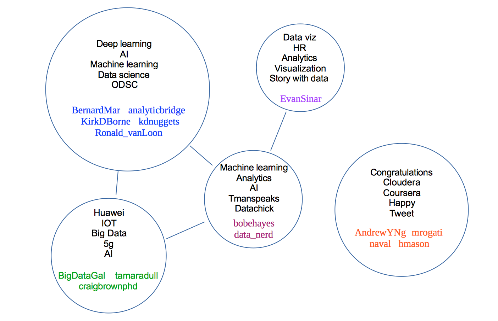

# twitter
### A brief exploration of clustering and classification on Twitter data

The goal of this project was to apply clustering and classification to text data with multiple authors. For the text data I chose to gather recent tweets from 15 data science influencers on Twitter, as identified in a [Hacker Noon post](https://hackernoon.com/15-big-data-analytics-and-data-science-influencers-you-should-be-following-2ad832bc1e5) I have seen referenced. They are (with their Twitter handles): Kirk Borne (KirkDBorne), Ronald van Loon (Ronald_vanLoon), Craig Brown (craigbrownphd), Bob Hayes (bobehayes), Bernard Marr (BernardMarr), Lillian Pierson (BigDataGal), Andrew Ng (AndrewYNg), Monica Rogati (mrogati), Carla Gentry (data_nerd), Gregory Piatetsky (kdnuggets), Vincent Granville (analyticsbridge), Naval Ravikant (naval), Tamara Dull (tamaradull), Hilary Mason (hmason) and Evan Sinar (Evan Sinar).

After fetching the most recent 500 tweets from each author that were not retweets, by filtering the most recent 800, I kept the full texts of the tweets as well as the hashtag and mention entities. I first attempted to cluster based on the entities, which provide a distinctive and limited set of terms to cluster on. It turned out, however, that the number of common entities, used by at least two authors, differed tremendously from author to author, with two of the authors having none, three others having less than 10 and three having more than 1,000 (the highest being more than 4,000). This invalidated the approach, and I moved on to try clustering on the text tweets with tf-idf vectorization. Since I wanted to cluster the authors, I combined the tweet texts into one document (list) for each author. Neither mean shift nor spectral clustering produced promising results, while k-means offered the advantage of being able to look at the cluster centers as points in the feature space, which gives an idea of the topics they most relate to, while the vectorization also allowed comparison of the scores of the words for each author.

