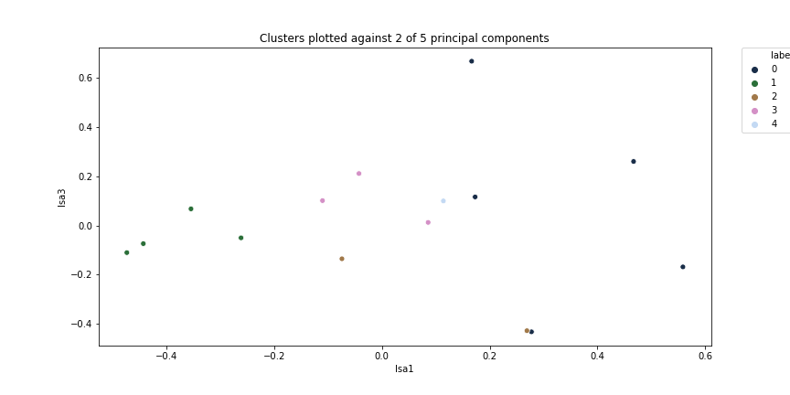

## A brief exploration of clustering and classification on Twitter data

The goal of this project was to apply clustering and classification to text data with multiple authors. For the text data I chose to gather recent tweets from 15 data science influencers on Twitter, as identified in a Hacker Noon post I have seen referenced. They are (with their Twitter handles): Kirk Borne (KirkDBorne), Ronald van Loon (Ronald_vanLoon), Craig Brown (craigbrownphd), Bob Hayes (bobehayes), Bernard Marr (BernardMarr), Lillian Pierson (BigDataGal), Andrew Ng (AndrewYNg), Monica Rogati (mrogati), Carla Gentry (data_nerd), Gregory Piatetsky (kdnuggets), Vincent Granville (analyticsbridge), Naval Ravikant (naval), Tamara Dull (tamaradull), Hilary Mason (hmason) and Evan Sinar (Evan Sinar).

## Clustering

After fetching the most recent 500 tweets from each author that were not retweets, by filtering the most recent 800, I kept the full texts of the tweets as well as the hashtag and mention entities. I first attempted to cluster based on the entities, which provide a distinctive and limited set of terms to cluster on. It turned out, however, that the number of common entities, used by at least two authors, differed tremendously from author to author, with two of the authors having none, three others having less than 10 and three having more than 1,000 (the highest being more than 4,000). This invalidated the approach, and I moved on to try clustering on the text tweets with tf-idf vectorization. Since I wanted to cluster the authors, I combined the tweet texts into one document (list) for each author. Neither mean shift nor spectral clustering produced promising results, while k-means offered the advantage of being able to look at the cluster centers as points in the feature space, which gives an idea of the topics they most relate to, while the vectorization also allowed comparison of the scores of the words for each author.

The initial attempt produced 7 clusters, with thematic similarity among the members of several of them, although two of the clusters contained only one author each and one contained the four authors who used few or no hashtags and mentions. The best clustering was found by first using 1,000 runs that looped through a range of cluster sizes to determine which produced the best (lowest) silhouette score. The optimal number of clusters was taken as the size that produced the best score the greatest number of times. Another 1,000 trials were then run using the best feature size to find the clustering with the best silhouette score. The Jupyter notebook contains a plot of these clusters against two LSA components.

Besides looking at the 10 highest-scoring terms for each author, a more programmatic attempt at surfacing similarity consisted of looping through the highest-ranked terms for each cluster center and finding those that had high tf-idf scores (above an experimentally determined threshold) for each member of that cluster. Additionally, I looked at the highest-ranking words for each cluster (whether or not members had them in common or as high-scoring words) to identify the main topics. These “rankings” essentially are how far the cluster center is along the axis representing each term in the feature space, which comprises all the terms in the tf-idf vectorization.

A second clustering attempt added in bigrams (using the n-gram functionality of sklearn’s tf-idf vectorizer. This time the optimal number of clusters was reduced to 6, which were identical to the initial 7 except that one of the formerly lone authors was assigned put into one of the existing clusters.

The third and final attempt tried to compensate for the highly divergent use of hashtags by matching where possible the hashtags in each author’s combined tweet texts with concatenated bigrams  that emerged as a tf-idf feature. For example, #machinelearning would match “machine learning.” For each match, including multiple matches for the same hashtag, the corresponding bigram was appended to the combined texts. The idea was to augment similarity scores between authors that used the same key two-word phrases whether as hashtags or as separate words. The optimal number of clusters went down to 5. The one author who had remained solitary on their own in the second clustering attempt was assigned to a pre-existing cluster, but a pre-existing 2-person cluster disappeared, with one member assigned to another group but the other now alone. These clusters were again plotted against two LSA components:

> *In the final clustering, none of the clusters overlap even though the two components being graphed explain less than 20% of the total variance. This low explained variance also provides reasonable cause for the two points closest together in the graph, near (0.3, -0.4) being assigned to different clusters.*

The main topics for the clusters changed little between the first and third attempts, although it became more difficult to find terms common to all cluster members as clusters increased in size. Following is a diagram showing the clusters and key terms close to the cluster centers:

## Classification  
For classification purposes, the tweet texts were first divided into stratified training and test sets, following the requested 60/40 split, that maintained class balance. The basic tf-idf vectorizer was used to fit and transform the training set, and then to transform the test set. It was not allowed to fit the test set to avoid data leakage. The vectorized training data was fed to a number of algorithms: random forest, gradient boosting, logistic regression and k-nearest neighbors. Additionally, ADA boosting was tried with the random forest and logistic regression classifiers. Initially, performance was compared using 4-fold cross-evaluation scoring on the stock estimators. The Matthews correlation coefficient was used for scoring, because it incorporates all of the confusion matrix information. Gradient boosting and logistic regression, without boosting, were the best performers.
